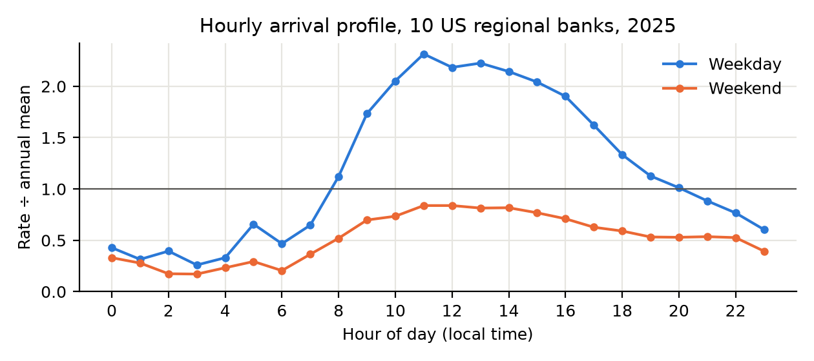
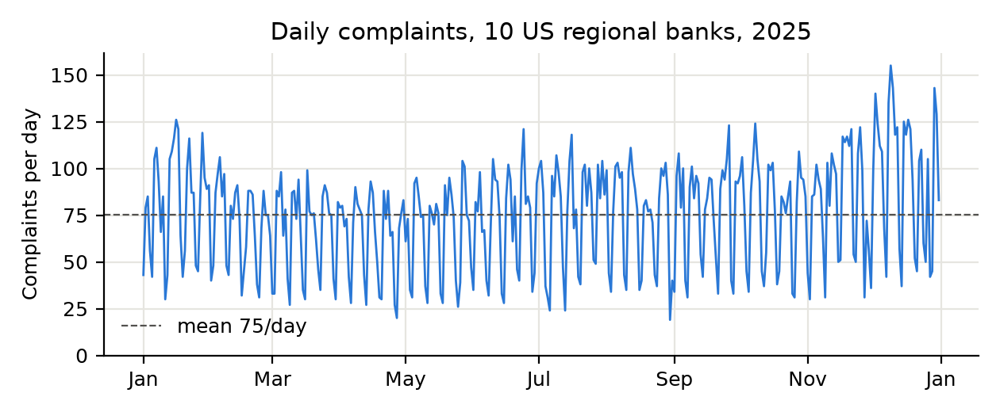
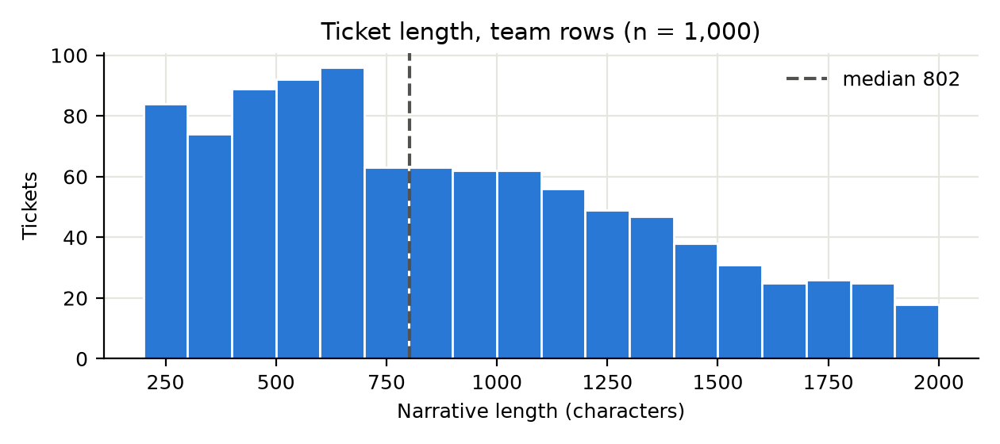

# Workload Model

This model contains quantitative estimates of the client's workload. All figures are produced by `WorkloadModel/workload_model.ipynb`, which fetches data live from the CFPB and logs the fetch time of each run in `data/fetch_log.csv`.

**Reference client.** Since the client's size is not given, the client is modelled on the median of 10 US regional banks (TD Bank US, U.S. Bancorp, Truist, PNC, Citizens, Fifth Third, Huntington, M&T, Regions, KeyCorp), which received **1,857** CFPB complaints in 2025 [1].

## 1. Ticket volume

Banks generally do not publish how many complaints they receive directly, so volume is given as a range:

- **Minimum:** complaints sent to the bank through the CFPB. Every CFPB complaint is forwarded to the bank [2].
- **Maximum:** all complaints customers make to the bank. 13% of customers complain in any 6-month window, so on average each customer makes at least `2 * 0.13 = 0.26` complaints a year. The reference client's customer count is estimated by scaling TD's published client count by the ratio of the two banks' CFPB complaints.
- **Expected:** complaints not resolved at first contact, which are the ones that become tickets.

| Variable | Meaning | Value | Source |
|---|---|---:|---|
| `client_complaints` | Reference client's CFPB complaints per year | 1,857 | Measured [1] |
| `complaint_rate` | Bank customers who complained in the past 6 months | 0.13 | ACSI [3][4] |
| `periods_per_year` | 6-month periods per year | 2 | - |
| `td_clients` | TD Bank US clients | 10,000,000 | TD [5] |
| `td_complaints` | TD's CFPB complaints per year | 5,594 | Measured [1] |
| `resolved_rate` | Problems resolved | 0.85 | J.D. Power [6] |
| `one_contact_rate` | Resolved problems fixed with one contact | 0.59 | J.D. Power [6] |
| `days_per_year` | Days per year | 365 | - |
| `hours_per_year` | Hours per year (365 * 24) | 8,760 | - |

```
complaints_per_customer_per_year = periods_per_year * complaint_rate
                                 = 2 * 0.13
                                 = 0.26

client_customers = td_clients * client_complaints / td_complaints
                 = 10,000,000 * 1,857 / 5,594
                 = 3,319,628

ticket_share = 1 - resolved_rate * one_contact_rate
             = 1 - 0.85 * 0.59
             = 0.4985

minimum_tickets_per_year  = client_complaints
                          = 1,857

maximum_tickets_per_year  = client_customers * complaints_per_customer_per_year
                          = 3,319,628 * 0.26
                          = 863,103

expected_tickets_per_year = maximum_tickets_per_year * ticket_share
                          = 863,103 * 0.4985
                          = 430,257

tickets_per_day  = tickets_per_year / days_per_year
                 = 1,857 / 365   = 5.1     (Minimum)
                 = 430,257 / 365 = 1,179   (Expected)
                 = 863,103 / 365 = 2,365   (Maximum)

tickets_per_hour = tickets_per_year / hours_per_year
                 = 1,857 / 8,760   = 0.21    (Minimum)
                 = 430,257 / 8,760 = 49.12   (Expected)
                 = 863,103 / 8,760 = 98.53   (Maximum)
```

| | Minimum | Expected | Maximum |
|---|---:|---:|---:|
| Tickets per year | 1,857 | 430,257 | 863,103 |
| Tickets per day | 5.1 | 1,179 | 2,365 |
| Tickets per hour (average) | 0.21 | 49 | 99 |

Expected is the model's estimate of the client's ticket volume. Minimum and Maximum are the lower and upper bounds around it.

## 2. Peak and non-peak periods

The factors below are measured from the timestamps of 27,522 CFPB complaints about the 10 banks in 2025 [1]. Each timestamp records the time a complaint was received to the second (e.g. 16:39:43), not just the date. The CFPB does not state the time zone, so the timestamps are treated as UTC and converted to the local time of each consumer's state; this places the weekday peak at midday. Each factor compares the arrival rate in a period with the annual average rate.




| Variable | Meaning | Value | Source |
|---|---|---:|---|
| `sample_complaints_per_hour` | Average complaints per hour across the 10 banks (27,522 / 8,760) | 3.142 | Measured [1] |
| `sample_complaints_per_day` | Average complaints per day across the 10 banks (27,522 / 365) | 75.40 | Measured [1] |
| `tuesday_noon_per_hour` | Average complaints in the Tuesday 12:00 hour (busiest hour of the week) | 8.288 | Measured [1] |
| `night_per_hour` | Average complaints per hour, 00:00 to 07:00 | 1.131 | Measured [1] |
| `weekend_peak_per_hour` | Average complaints in the busiest weekend hour (11:00) | 2.635 | Measured [1] |
| `tuesday_per_day` | Average complaints per Tuesday (busiest weekday) | 97.79 | Measured [1] |
| `december_per_day` | Average complaints per day in December (busiest month) | 97.19 | Measured [1] |
| `median_busiest_day_ratio` | Busiest day / average day, median of the 10 banks | 2.91 | Measured [1] |
| `highest_busiest_day_ratio` | Busiest day / average day, highest of the 10 banks | 3.84 | Measured [1] |
| `surge_factor` | Surge multiple applied to peak (rounded from the event excess below) | 2 | Derived |

```
busiest_hour_factor    = tuesday_noon_per_hour / sample_complaints_per_hour  = 8.288 / 3.142  = 2.638
night_factor           = night_per_hour / sample_complaints_per_hour         = 1.131 / 3.142  = 0.360
weekend_peak_factor    = weekend_peak_per_hour / sample_complaints_per_hour  = 2.635 / 3.142  = 0.839
busiest_weekday_factor = tuesday_per_day / sample_complaints_per_day         = 97.79 / 75.40  = 1.297
busiest_month_factor   = december_per_day / sample_complaints_per_day        = 97.19 / 75.40  = 1.289

peak_factor = busiest_hour_factor * busiest_month_factor
            = 2.638 * 1.289
            = 3.400

event_excess (median) = median_busiest_day_ratio / (busiest_weekday_factor * busiest_month_factor)
                      = 2.91 / (1.297 * 1.289)
                      = 1.74

event_excess (highest) = highest_busiest_day_ratio / (busiest_weekday_factor * busiest_month_factor)
                       = 3.84 / (1.297 * 1.289)
                       = 2.30

surge_factor = 2 (between 1.74 and 2.30, rounded)

Using Expected tickets_per_hour = 49.12:
night_rate  = tickets_per_hour * night_factor
            = 49.12 * 0.360 = 17.7

peak_rate   = tickets_per_hour * peak_factor
            = 49.12 * 3.400 = 167.0

surge_rate  = peak_rate * surge_factor
            = 167.0 * 2 = 334.0

arrival_rate_per_second = peak_rate / 3,600
                        = 167.0 / 3,600 = 0.0464

interarrival_time = 1 / arrival_rate_per_second
                  = 1 / 0.0464 = 21.6 seconds

peak_p99 = smallest count where P(Poisson(peak_rate) <= count) >= 0.99
         = smallest count where P(Poisson(167.0) <= count) >= 0.99
         = 198
```

### Tickets per hour
| Period | Minimum | Expected | Maximum |
|---|---:|---:|---:|
| Night | 0.08 | 18 | 35 |
| Average | 0.21 | 49 | 99 |
| Peak | 0.72 | 167 | 335 |
| Peak, p99 | 3 | 198 | 378 |
| Surge | 1.44 | 334 | 670 |

### Peak and surge per second
| | Minimum | Expected | Maximum |
|---|---:|---:|---:|
| Peak arrival rate (tickets per second) | 0.0002 | 0.0464 | 0.0931 |
| Peak interarrival time (seconds) | 4,994 | 21.6 | 10.7 |
| Surge arrival rate (tickets per second) | 0.0004 | 0.0928 | 0.1861 |
| Surge interarrival time (seconds) | 2,497 | 10.8 | 5.4 |

## 3. Agent search rate

Agents search only during business hours and keep pace with intake. Each ticket gets one duplicate check when first opened, plus one look-up for each ticket that needs another touch. The upper value assumes two more look-ups, one for related open tickets and one for similar past cases.

| Variable | Meaning | Value | Source |
|---|---|---:|---|
| `business_hours_per_week` | Mon to Fri, 09:00 to 17:00 | 40 | Assumption |
| `weeks_per_year` | 365 / 7 | 52.14 | - |
| `one_touch_rate` | Finance tickets solved in one touch | 0.72 | Zendesk [7] |
| `duplicate_checks_per_ticket` | Searches when a ticket is first opened | 1 | Assumption |
| `searches_per_ticket_upper` | Searches per ticket, upper value | 3 | Assumption |
| `busiest_month_factor` | From section 2 | 1.289 | Measured [1] |

```
revisits_per_ticket = 1 - one_touch_rate
                    = 1 - 0.72
                    = 0.28

searches_per_ticket_lower = duplicate_checks_per_ticket + revisits_per_ticket
                          = 1 + 0.28
                          = 1.28

Using Expected tickets_per_year = 430,257:
tickets_handled_per_business_hour = tickets_per_year / weeks_per_year / business_hours_per_week
                                  = 430,257 / 52.14 / 40
                                  = 206.3

searches_per_hour_peak_month = tickets_handled_per_business_hour * busiest_month_factor * searches_per_ticket
                             = 206.3 * 1.289 * 1.28 = 340 (lower)
                             = 206.3 * 1.289 * 3 = 798 (upper)
```

### Searches per hour (December, peak month)
| Searches per ticket | Minimum | Expected | Maximum |
|---|---:|---:|---:|
| 1.28 | 1.47 | 340 | 683 |
| 3 | 3.44 | 798 | 1,600 |

## 4. Ticket length

Ticket length was measured on the team's 1,000 rows (5000 to 5999) of the course dataset. Token counts are estimated using OpenAI's guideline that English text averages about four characters per token [8]. Every request also sends the classification instructions to the model, so their characters are added to each ticket's.



| Variable | Meaning | Value | Source |
|---|---|---:|---|
| `ticket_characters` | Length of a ticket narrative in characters (median shown) | 802 | Measured |
| `prompt_characters` | Characters in the classification instructions sent with every ticket (`SYSTEM_PROMPT` in `app/main.py`) | 274 | Measured |
| `characters_per_token` | Average characters per token in English text | 4 | OpenAI [8] |
| `mean_characters` | Mean ticket length in characters | 883.0 | Measured |
| `standard_deviation_characters` | Standard deviation of ticket length in characters | 464.8 | Measured |

```
Using median ticket_characters:
estimated_tokens = (ticket_characters + prompt_characters) / characters_per_token
                 = (802 + 274) / 4
                 = 269

coefficient_of_variation = standard_deviation_characters / mean_characters
                         = 464.8 / 883.0
                         = 0.53
```

A coefficient of variation of 0.53 means ticket lengths vary moderately around the mean, so the work per classification varies too.

| | min | p25 | median | p75 | p95 | p99 | max |
|---|---:|---:|---:|---:|---:|---:|---:|
| Characters | 200 | 507 | 802 | 1,217 | 1,772 | 1,930 | 2,000 |
| Words | 32 | 91 | 143 | 216 | 311 | 355 | 395 |
| Tokens per request (est., incl. prompt) | 118 | 195 | 269 | 372 | 511 | 551 | 568 |

## 5. Limitations

- TD is the only peer bank that publishes a customer count. The reference client is assumed to have the same ratio of CFPB complaints to customers.
- ACSI and J.D. Power survey customers of the largest US banks. ACSI's 6-month window makes 0.26 complaints per customer per year a lower bound.
- The Zendesk benchmark dates from 2012. `duplicate_checks_per_ticket`, `searches_per_ticket_upper` and `business_hours_per_week` are assumptions.

## References

1. CFPB, Consumer Complaint Database (API). https://www.consumerfinance.gov/data-research/consumer-complaints/
2. CFPB, Learn how the complaint process works. https://www.consumerfinance.gov/complaint/process/
3. ACSI, Finance Study 2024-2025 (Feb 2025). https://theacsi.com/wp-content/uploads/2025/02/25feb_Finance-Study_FINAL.pdf
4. Morgeson et al. (2023), The ACSI: A sample dataset and description, *Data in Brief*. https://pmc.ncbi.nlm.nih.gov/articles/PMC10148075
5. TD Bank, Corporate profile (31 Jul 2026). https://www.td.com/content/dam/tdb/document/pdf/about-us/td-bank-corporate-profile-en.pdf
6. J.D. Power, 2025 U.S. Retail Banking Satisfaction Study. https://www.jdpower.com/business/press-releases/2025-us-retail-banking-satisfaction-study
7. Zendesk, The Zendesk Benchmark (Q2 2012). https://d16cvnquvjw7pr.cloudfront.net/resources/whitepapers/Zendesk_WP_benchmark.pdf
8. OpenAI, What are tokens and how to count them? https://help.openai.com/en/articles/4936856-what-are-tokens-and-how-to-count-them
